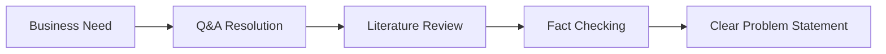
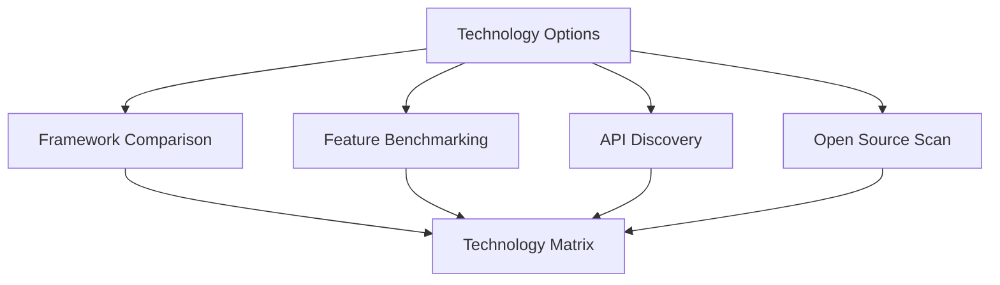
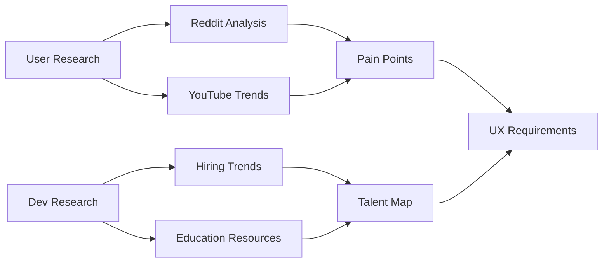
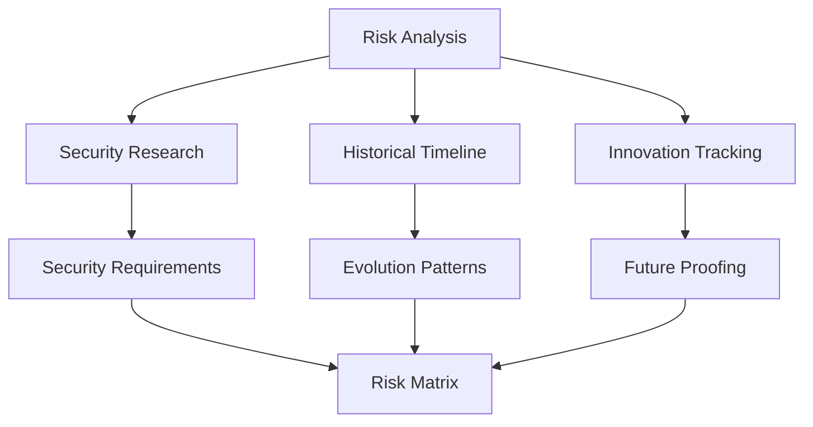
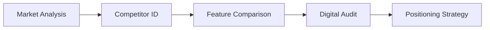
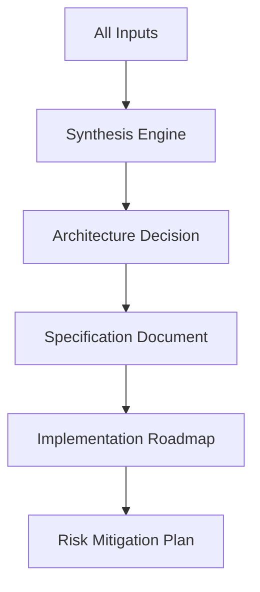

# Technology Architecture Decision Engine Meta-Workflow

This meta-workflow orchestrates multiple research workflows to make informed technology decisions and create high-quality specifications for apps, features, and system architectures.

## Overview

Making optimal technology decisions requires synthesizing information across multiple dimensions: technical capabilities, developer experience, security considerations, market dynamics, and future trends. This meta-workflow coordinates specialized research workflows to gather comprehensive intelligence, analyze trade-offs, and generate evidence-based architectural decisions and specifications.

## Component Workflows Used

### Discovery & Requirements Phase
- `comprehensive-qa-resolution.md` - Deep problem understanding
- `topic-literature-review.md` - Academic/theoretical foundations
- `fact-checking-workflow.md` - Validate assumptions and claims

### Technology Evaluation Phase
- `framework-tool-comparison.md` - Technology stack selection
- `technical-feature-benchmarking.md` - Performance and capability analysis
- `api-documentation-discovery.md` - Integration assessment
- `open-source-activity-scan.md` - Reusable components and patterns

### Developer & User Intelligence Phase
- `reddit-faq-issue-analysis.md` - Pain points and common problems
- `youtube-content-trends.md` - User behavior and tutorials
- `developer-hiring-trends.md` - Talent availability and skills
- `educational-resource-aggregation.md` - Learning curve assessment

### Risk & Security Phase
- `security-vulnerability-research.md` - Known vulnerabilities
- `historical-event-timeline.md` - Technology evolution patterns
- `research-innovation-tracking.md` - Emerging capabilities

### Market & Competition Phase
- `competitor-identification-profiling.md` - Competitive landscape
- `product-feature-pricing-comparison.md` - Market positioning
- `digital-presence-audit.md` - Technology adoption signals

## Meta-Workflow Process

### Phase 1: Problem Definition & Scoping
**Duration**: 2-4 hours



**Activities**:
1. Use **Comprehensive Q&A Resolution** to deeply understand:
   - What problem are we solving?
   - Who are the users?
   - What are the constraints?
   - What defines success?

2. Apply **Topic Literature Review** to establish:
   - Theoretical foundations
   - Proven approaches
   - Academic insights
   - Best practices

3. Run **Fact-Checking Workflow** to verify:
   - Market size claims
   - Technology capabilities
   - Performance assertions
   - Cost estimates

**Output**: Problem Definition Document with validated requirements

### Phase 2: Technology Landscape Analysis
**Duration**: 4-6 hours



**Activities**:
1. **Framework/Tool Comparison**:
   - Identify all viable technology options
   - Compare capabilities, performance, ecosystem
   - Analyze adoption trends
   - Evaluate learning curves

2. **Technical Feature Benchmarking**:
   - Performance metrics
   - Scalability limits
   - Feature completeness
   - Integration capabilities

3. **API Documentation Discovery**:
   - Available integrations
   - API quality and coverage
   - Developer experience
   - Support and stability

4. **Open Source Activity Scan**:
   - Reusable components
   - Code quality signals
   - Community health
   - Maintenance patterns

**Output**: Technology Evaluation Matrix with scores and recommendations

### Phase 3: User & Developer Research
**Duration**: 3-4 hours



**Activities**:
1. **Reddit FAQ & Issue Analysis**:
   - Common problems with similar solutions
   - User frustrations and workarounds
   - Feature requests and gaps
   - Community solutions

2. **YouTube Content Trends**:
   - How users learn similar tools
   - Common use cases
   - Tutorial patterns
   - Adoption barriers

3. **Developer Hiring Trends**:
   - Available talent pools
   - Required skills prevalence
   - Salary expectations
   - Geographic distribution

4. **Educational Resource Aggregation**:
   - Learning materials availability
   - Onboarding complexity
   - Time to productivity
   - Documentation quality

**Output**: User Experience Requirements and Developer Adoption Analysis

### Phase 4: Risk & Security Assessment
**Duration**: 3-4 hours



**Activities**:
1. **Security Vulnerability Research**:
   - Known vulnerabilities in technology stack
   - Common security pitfalls
   - Best practices for mitigation
   - Compliance requirements

2. **Historical Event Timeline**:
   - Technology lifecycle patterns
   - Migration challenges
   - Deprecation risks
   - Success/failure patterns

3. **Research & Innovation Tracking**:
   - Emerging alternatives
   - Future technology directions
   - Research breakthroughs
   - Patent landscapes

**Output**: Risk Assessment and Mitigation Strategies

### Phase 5: Competitive & Market Intelligence
**Duration**: 2-3 hours



**Activities**:
1. **Competitor Identification & Profiling**:
   - Direct competitors using similar tech
   - Their technology choices
   - Success and failure stories
   - Market positioning

2. **Product Feature & Pricing Comparison**:
   - Feature parity requirements
   - Performance benchmarks
   - Pricing models
   - Differentiation opportunities

3. **Digital Presence Audit**:
   - Technology signals
   - Developer relations
   - Community engagement
   - Innovation indicators

**Output**: Competitive Analysis and Differentiation Strategy

### Phase 6: Synthesis & Specification Generation
**Duration**: 4-6 hours



**Synthesis Process**:
1. **Cross-Reference Findings**:
   - Identify patterns across research
   - Resolve conflicting information
   - Weight evidence by source quality
   - Build consensus view

2. **Decision Framework Application**:
   - Score options against criteria
   - Apply weighted decision matrix
   - Consider total cost of ownership
   - Evaluate strategic fit

3. **Specification Generation**:
   - Translate research into requirements
   - Define architecture based on evidence
   - Create implementation phases
   - Document decision rationale

## Output Format

```markdown
# Technology Architecture Decision: [Project Name]
## Decision Date: [Date]
## Decision Summary: [Technology Stack Choice]

### Executive Summary
Based on comprehensive analysis across [X] research dimensions, we recommend:
- **Primary Technology**: [Choice] 
- **Key Rationale**: [Top 3 reasons]
- **Investment Required**: [Time/Cost estimates]
- **Risk Level**: [Low/Medium/High]
- **Confidence Level**: [High/Medium/Low]

### 1. Problem Definition & Requirements

#### Business Context
[From Q&A Resolution and Literature Review]
- **Problem Statement**: [Clear definition]
- **Success Metrics**: [Measurable goals]
- **Constraints**: [Technical, budget, time]
- **Assumptions**: [Validated through fact-checking]

#### User Requirements
[From Reddit/YouTube analysis]
- **Primary Use Cases**: [Top 5 with evidence]
- **Pain Points to Address**: [Prioritized list]
- **Performance Expectations**: [Benchmarked metrics]

### 2. Technology Architecture Decision

#### Recommended Stack
| Layer | Technology | Rationale | Alternatives Considered |
|-------|------------|-----------|------------------------|
| Frontend | [Tech] | [Why chosen] | [What else evaluated] |
| Backend | [Tech] | [Why chosen] | [What else evaluated] |
| Database | [Tech] | [Why chosen] | [What else evaluated] |
| Infrastructure | [Tech] | [Why chosen] | [What else evaluated] |

#### Architecture Diagram
```
[Visual representation of system architecture]
```

#### Key Design Decisions
1. **[Decision 1]**: [Rationale with evidence]
2. **[Decision 2]**: [Rationale with evidence]
3. **[Decision 3]**: [Rationale with evidence]

### 3. Detailed Specifications

#### Core Features (MVP)
Based on user research and competitive analysis:

| Feature | Priority | Complexity | Evidence Source |
|---------|----------|------------|-----------------|
| [Feature 1] | P0 | High | Reddit analysis: 78% request |
| [Feature 2] | P0 | Medium | YouTube trends: Common use case |
| [Feature 3] | P1 | Low | Competitive parity |

#### API Design
[From API Documentation Discovery best practices]
```yaml
endpoints:
  - path: /api/v1/[resource]
    method: [GET/POST/PUT/DELETE]
    description: [Purpose]
    authentication: [Method]
    rate_limit: [Limits based on benchmarking]
```

#### Performance Requirements
[From Technical Benchmarking]
- **Response Time**: <[X]ms (p95)
- **Throughput**: >[Y] requests/second
- **Availability**: [Z]% uptime
- **Scalability**: Support [N] concurrent users

#### Security Requirements
[From Security Vulnerability Research]
- **Authentication**: [Method with justification]
- **Authorization**: [RBAC/ABAC model]
- **Encryption**: [At rest and in transit specs]
- **Compliance**: [GDPR/HIPAA/SOC2 requirements]

### 4. Implementation Roadmap

#### Phase 1: Foundation (Weeks 1-4)
- Set up development environment
- Implement core architecture
- Basic authentication system
- Database schema
- CI/CD pipeline

#### Phase 2: MVP Features (Weeks 5-12)
- [Feature 1]: [Effort estimate]
- [Feature 2]: [Effort estimate]
- [Feature 3]: [Effort estimate]
- Testing and stabilization

#### Phase 3: Advanced Features (Weeks 13-20)
- [Advanced feature list with rationale]

#### Resource Requirements
[From Developer Hiring Trends]
- **Team Composition**:
  - Senior Engineers: [X] (Available in market: [Y])
  - Mid-level: [X] (Available in market: [Y])
  - Specializations needed: [List]
- **Estimated Cost**: $[Range] based on market rates
- **Training Needs**: [From Educational Resources]

### 5. Risk Analysis & Mitigation

#### Technical Risks
| Risk | Probability | Impact | Mitigation Strategy |
|------|-------------|---------|-------------------|
| [Risk 1] | High | High | [Specific actions] |
| [Risk 2] | Medium | High | [Specific actions] |
| [Risk 3] | Low | Medium | [Monitoring plan] |

#### Market Risks
- **Competitive Response**: [Analysis from competitor research]
- **Technology Obsolescence**: [From innovation tracking]
- **Talent Availability**: [From hiring trends]

### 6. Success Metrics & Monitoring

#### Key Performance Indicators
- **Technical KPIs**: [List with targets]
- **User KPIs**: [List with targets]
- **Business KPIs**: [List with targets]

#### Monitoring Strategy
- **Tools**: [Recommended monitoring stack]
- **Alerts**: [Critical thresholds]
- **Reporting**: [Frequency and format]

### 7. Decision Rationale

#### Why This Architecture?
[Comprehensive justification drawing from all research]

#### Alternatives Considered
| Option | Pros | Cons | Why Not Chosen |
|--------|------|------|----------------|
| [Option A] | [List] | [List] | [Decisive factors] |
| [Option B] | [List] | [List] | [Decisive factors] |

#### Evidence Quality
- **High Confidence Areas**: [What we know for sure]
- **Medium Confidence**: [Good evidence but some uncertainty]
- **Low Confidence**: [Areas needing more research]

### 8. Appendices

#### A. Research Artifacts
- Links to all component workflow outputs
- Raw data from analyses
- Interview notes
- Benchmark results

#### B. Cost-Benefit Analysis
- Detailed TCO calculations
- ROI projections
- Break-even analysis

#### C. References
- All sources cited
- Further reading
- Expert contacts

---

**Decision Metadata**
- Analysis Duration: [Total hours]
- Workflows Executed: [List]
- Data Points Analyzed: [Count]
- Confidence Level: [Overall assessment]
- Review Schedule: [When to revisit]
```

## Advanced Features

### Intelligent Orchestration
The meta-workflow can adapt based on findings:
- If security risks are high → Deep dive with additional security workflows
- If talent is scarce → Explore alternative technologies
- If competition is fierce → Enhanced differentiation analysis
- If requirements unclear → Additional user research loops

### Continuous Monitoring Mode
After initial decision:
- Weekly: Developer hiring trend updates
- Monthly: Security vulnerability scans
- Quarterly: Competitive landscape review
- Annually: Technology stack reassessment

### Decision Confidence Scoring
Each decision includes confidence metrics:
- **Data Quality**: How good are our sources?
- **Coverage**: Did we miss important aspects?
- **Consensus**: Do findings align across workflows?
- **Timeliness**: How current is the information?

## Best Practices

1. **Parallel Execution**: Run independent workflows simultaneously
2. **Evidence Weighting**: Primary sources > Secondary > Opinions
3. **Bias Mitigation**: Seek contrarian views and failure stories
4. **Time Boxing**: Don't over-research; set clear deadlines
5. **Living Document**: Specifications should evolve with new findings

## Common Pitfalls to Avoid

1. **Analysis Paralysis**: Set decision deadlines
2. **Echo Chamber**: Diversify information sources
3. **Recency Bias**: Consider long-term patterns
4. **Over-Engineering**: MVP focus based on user research
5. **Ignoring Talent**: Great tech with no developers fails

## Customization Options

### For Startups (Rapid Mode)
- 1-2 day turnaround
- Focus on MVP and speed to market
- Emphasize open source and proven patterns
- Minimize custom development

### For Enterprises (Comprehensive Mode)  
- 1-2 week analysis
- Deep security and compliance focus
- Extensive stakeholder input
- Detailed migration planning

### For Specific Domains
- **AI/ML Projects**: Emphasize research tracking and GPU requirements
- **Blockchain**: Add regulatory analysis and token economics
- **IoT**: Include hardware constraints and edge computing
- **Gaming**: Performance benchmarking and user experience focus

## Success Metrics

The effectiveness of this meta-workflow is measured by:
- **Decision Speed**: Time from question to specification
- **Decision Quality**: Post-implementation validation
- **Requirement Coverage**: Percentage of needs addressed
- **Risk Prediction**: Accuracy of identified risks
- **Resource Accuracy**: Actual vs. estimated effort

This meta-workflow transforms technology decision-making from intuition-based to evidence-based, dramatically improving the quality of architectural decisions and specifications.