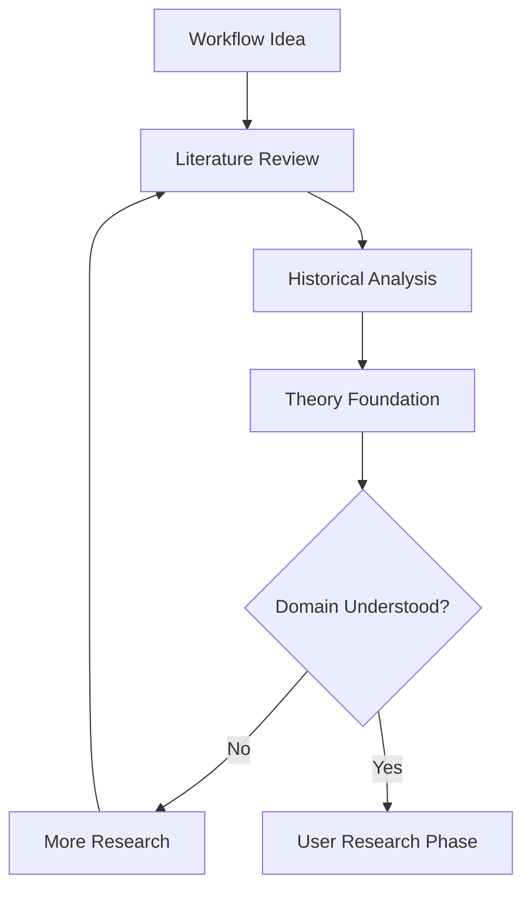
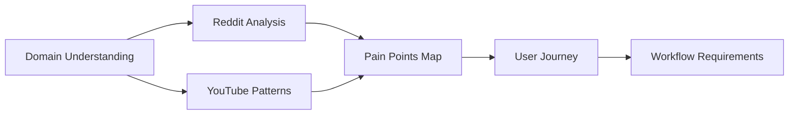
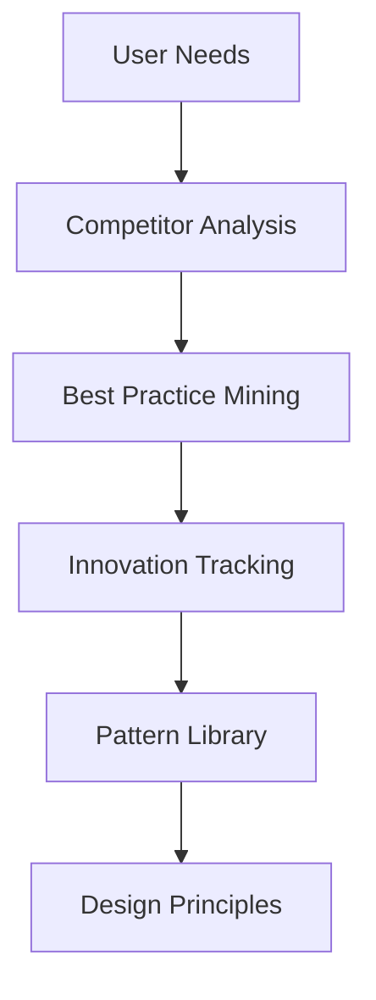
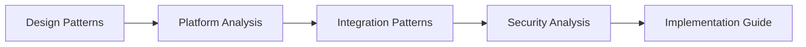
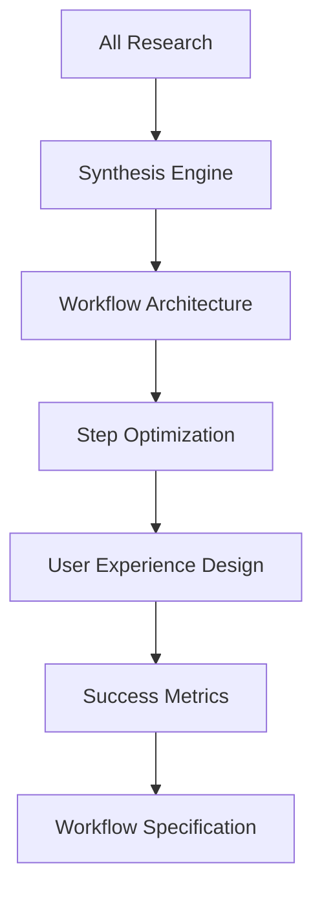
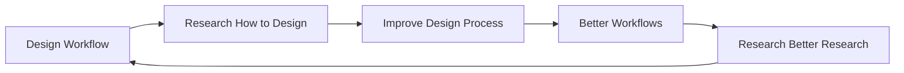

# Workflow Design Research Engine Meta-Workflow

This meta-workflow researches how to create better workflows by analyzing successful processes, user needs, failure patterns, and optimization opportunities to design evidence-based workflow orchestrations.

## Overview

Creating effective workflows requires understanding what works, what fails, and what users actually need. This meta-workflow systematically researches workflow design by analyzing existing processes, studying user behavior, identifying pain points, and synthesizing insights to create optimal workflow architectures. It's the workflow that designs workflows.

## Component Workflows Used

### Process Analysis Phase
- `topic-literature-review.md` - Academic research on workflow design
- `historical-event-timeline.md` - Evolution of successful processes
- `fact-checking-workflow.md` - Validate workflow effectiveness claims
- `comprehensive-qa-resolution.md` - Deep understanding of workflow theory

### User Research Phase
- `reddit-faq-issue-analysis.md` - Common workflow pain points
- `youtube-content-trends.md` - How people learn processes
- `social-engagement-benchmarking.md` - Workflow adoption patterns
- `sentiment-analysis-across-platforms.md` - User satisfaction with processes

### Best Practices Discovery Phase
- `competitive-analysis-strategy.md` - Analyze successful workflow systems
- `innovation-ip-scan.md` - Novel workflow approaches
- `research-innovation-tracking.md` - Cutting-edge process design
- `open-source-activity-scan.md` - Community-built workflows

### Implementation Intelligence Phase
- `developer-hiring-trends.md` - Skills needed for workflow building
- `api-documentation-discovery.md` - Tool integration patterns
- `security-vulnerability-research.md` - Workflow failure modes
- `framework-tool-comparison.md` - Workflow platform evaluation

## Meta-Meta-Workflow Process

### Phase 1: Workflow Domain Analysis
**Duration**: 3-4 hours
**Goal**: Understand the target workflow's problem space



**Activities**:

1. **Topic Literature Review** on [Workflow Domain]:
   ```
   Search patterns:
   - "[domain] process optimization"
   - "[domain] workflow best practices"
   - "[domain] automation research"
   - "[domain] efficiency studies"
   - "process improvement [domain]"
   ```
   
   Extract:
   - Theoretical frameworks
   - Proven methodologies
   - Academic insights
   - Performance metrics

2. **Historical Event Timeline** of [Domain Evolution]:
   - Key process innovations
   - Failed automation attempts
   - Successful transformations
   - Technology enablers
   - Paradigm shifts

3. **Fact-Checking** of common beliefs:
   - "Automation always improves efficiency"
   - "More steps mean better outcomes"
   - "Users prefer guided processes"
   - Benchmark claims

**Output**: Domain Knowledge Foundation with validated principles

### Phase 2: User Behavior & Pain Point Analysis
**Duration**: 4-5 hours
**Goal**: Understand how people actually work in this domain



**Activities**:

1. **Reddit FAQ & Issue Analysis**:
   ```
   Research focus:
   - r/[domain] common questions
   - "How do I [process]" frequency
   - Workflow failure stories
   - Manual vs. automated preferences
   - Time spent on tasks
   - Frustration indicators
   ```

2. **YouTube Content Trends**:
   - Tutorial popularity patterns
   - Step-by-step video engagement
   - Comment pain points
   - Workaround demonstrations
   - Expert vs. beginner approaches

3. **Social Engagement Benchmarking**:
   - Which process posts get engagement
   - Community response to workflow tools
   - Sharing patterns for helpful processes
   - Tool recommendation patterns

**Output**: User Behavior Profile with validated pain points

### Phase 3: Successful Workflow Pattern Analysis
**Duration**: 3-4 hours
**Goal**: Identify what makes workflows effective



**Activities**:

1. **Competitive Analysis** of existing solutions:
   - Popular workflow tools in domain
   - User satisfaction ratings
   - Feature adoption patterns
   - Common complaints
   - Abandonment reasons

2. **Innovation & IP Scan**:
   - Novel workflow approaches
   - Patent landscapes
   - Emerging methodologies
   - Academic innovations
   - Startup approaches

3. **Research Innovation Tracking**:
   - Cutting-edge process research
   - AI workflow augmentation
   - Automation boundaries
   - Human-AI collaboration patterns

**Output**: Best Practice Pattern Library with innovation opportunities

### Phase 4: Technical Implementation Research
**Duration**: 2-3 hours
**Goal**: Understand how to build effective workflows



**Activities**:

1. **Framework/Tool Comparison** for workflow platforms:
   - Workflow engines (Zapier, Make, etc.)
   - Custom development frameworks
   - Low-code/no-code options
   - Integration capabilities
   - Scalability patterns

2. **API Documentation Discovery**:
   - Common integration patterns
   - Data flow designs
   - Error handling approaches
   - User interface patterns
   - Feedback mechanisms

3. **Security Vulnerability Research**:
   - Common workflow failures
   - Data privacy concerns
   - Authentication patterns
   - Audit trail requirements
   - Compliance considerations

**Output**: Technical Architecture Guidelines

### Phase 5: Optimization Strategy Development
**Duration**: 3-4 hours
**Goal**: Design the optimal workflow based on research



**Activities**:

1. **Pattern Synthesis**:
   - Combine successful patterns
   - Resolve conflicting approaches
   - Adapt to specific domain needs
   - Account for user preferences

2. **User Experience Optimization**:
   - Minimize cognitive load
   - Reduce manual steps
   - Provide clear feedback
   - Enable customization
   - Support different skill levels

3. **Success Metrics Definition**:
   - Time savings measurements
   - Accuracy improvements
   - User satisfaction indicators
   - Adoption rate targets
   - Error reduction goals

**Output**: Optimized Workflow Design Specification

## Output Format

```markdown
# Workflow Design Research Report: [Target Workflow Name]
## Research Date: [Date]
## Domain: [Workflow Domain]

### Executive Summary
Based on analysis of [X] research sources, [Y] user discussions, and [Z] existing solutions, the optimal workflow for [domain] should:

- **Core Insight**: [Main discovery about what works]
- **Key Innovation**: [Unique approach identified]
- **User Priority**: [What users value most]
- **Success Factor**: [Critical element for adoption]

### 1. Domain Knowledge Foundation

#### Theoretical Framework
Based on literature review of [X] academic sources:

**Established Principles**:
1. **[Principle 1]**: [Description] - [Evidence]
2. **[Principle 2]**: [Description] - [Evidence]
3. **[Principle 3]**: [Description] - [Evidence]

**Historical Evolution**:
```
[Year]: [Key development] → Led to [outcome]
[Year]: [Innovation] → Enabled [capability]
[Year]: [Breakthrough] → Changed [approach]
```

**Validated Facts**:
- ✅ [Fact 1]: Confirmed by [X] studies
- ✅ [Fact 2]: Proven in [Y] implementations
- ❌ [Myth 1]: Debunked by [evidence]
- ❌ [Myth 2]: No evidence found

### 2. User Behavior Analysis

#### Pain Point Frequency (from Reddit analysis)
| Pain Point | Mentions/Month | Severity | Current Solutions |
|------------|----------------|----------|-------------------|
| [Problem 1] | [X] | High | [Workarounds] |
| [Problem 2] | [Y] | Medium | [Workarounds] |
| [Problem 3] | [Z] | High | [None] |

#### User Journey Current State
```
Step 1: [Action] → Time: [X]min → Friction: [Pain points]
Step 2: [Action] → Time: [Y]min → Friction: [Pain points]
Step 3: [Action] → Time: [Z]min → Friction: [Pain points]
Total: [Total time] → Success Rate: [X]%
```

#### YouTube Learning Patterns
- **Most Watched**: "[Video type]" - [X] avg views
- **Highest Engagement**: "[Content type]" - [Y]% engagement
- **Common Questions**: [List from comments]
- **Drop-off Points**: [Where people stop watching]

### 3. Successful Pattern Analysis

#### Best Practice Patterns
From analysis of successful workflows:

**Pattern 1: [Name]**
- Used by: [X]% of successful implementations
- Benefits: [Outcomes]
- Implementation: [How to apply]
- Evidence: [Sources]

**Pattern 2: [Name]**
- Used by: [Y]% of successful implementations
- Benefits: [Outcomes]
- Implementation: [How to apply]
- Evidence: [Sources]

#### Innovation Opportunities
1. **[Innovation Area]**: [Description]
   - Current Gap: [What's missing]
   - Technology Enabler: [What makes it possible now]
   - Expected Impact: [Projected benefits]

### 4. Technical Architecture Research

#### Platform Comparison
| Platform | Strengths | Weaknesses | Best For | User Rating |
|----------|-----------|------------|----------|-------------|
| [Option 1] | [List] | [List] | [Use case] | [X]/5 |
| [Option 2] | [List] | [List] | [Use case] | [Y]/5 |

#### Integration Requirements
Based on API documentation analysis:
- **Data Sources**: [Required integrations]
- **Output Formats**: [User preferences]
- **Authentication**: [Security patterns]
- **Rate Limits**: [Scalability considerations]

#### Common Failure Modes
From security vulnerability research:
1. **[Failure Type]**: [Description] - [Prevention]
2. **[Failure Type]**: [Description] - [Prevention]

### 5. Optimal Workflow Design

#### Core Architecture
```
[Input] → [Process 1] → [Decision Point] → [Process 2] → [Output]
           ↓              ↓                  ↓
      [Feedback]    [Alternative]      [Validation]
```

#### Step-by-Step Optimization

**Step 1: [Name]**
- Purpose: [Why this step exists]
- User Research: [Pain point addressed]
- Best Practice: [Pattern applied]
- Innovation: [Unique improvement]
- Success Metric: [How to measure]

**Step 2: [Name]**
[Similar structure for each step]

#### User Experience Principles
1. **Minimize Cognitive Load**: [How achieved]
2. **Provide Clear Feedback**: [Implementation]
3. **Enable Recovery**: [Error handling]
4. **Support Customization**: [Flexibility points]

### 6. Implementation Recommendations

#### Development Approach
Based on technical research:
- **Platform**: [Recommended] because [rationale]
- **Architecture**: [Pattern] for [reasons]
- **Integrations**: [Priority order]
- **Timeline**: [Phased approach]

#### User Adoption Strategy
From engagement research:
1. **Onboarding**: [Evidence-based approach]
2. **Training**: [Content format preferences]
3. **Support**: [Community vs. documentation]
4. **Feedback**: [Collection and iteration]

### 7. Success Metrics & Validation

#### Primary KPIs
- **Efficiency**: [X]% time reduction (baseline: [current])
- **Accuracy**: [Y]% error reduction (baseline: [current])
- **Adoption**: [Z]% user retention (target: [goal])
- **Satisfaction**: [A]/10 user rating (target: [goal])

#### Validation Experiments
1. **[Experiment 1]**: [Description] - [Success criteria]
2. **[Experiment 2]**: [Description] - [Success criteria]

#### Iterative Improvement Plan
- Week 1-2: [Initial validation]
- Month 1: [User feedback integration]
- Month 3: [Optimization based on usage data]
- Month 6: [Major refinements]

### 8. Risk Analysis

#### Identified Risks
| Risk | Probability | Impact | Mitigation |
|------|-------------|---------|------------|
| [Risk 1] | Medium | High | [Strategy] |
| [Risk 2] | Low | Medium | [Strategy] |

#### Failure Prevention
Based on historical analysis:
- **[Past Failure]**: Prevented by [design choice]
- **[Common Pitfall]**: Avoided through [approach]

### 9. Competitive Positioning

#### Differentiation Strategy
Our workflow will be better because:
1. **[Advantage 1]**: [Evidence from research]
2. **[Advantage 2]**: [Evidence from research]
3. **[Advantage 3]**: [Evidence from research]

#### Market Opportunity
- **Addressable Users**: [Size] based on [research]
- **Current Solutions**: [Gaps identified]
- **Switching Cost**: [Low/Medium/High] because [analysis]

---

## Research Quality Assessment

### Source Reliability
- **Academic Sources**: [X] peer-reviewed papers
- **User Research**: [Y] real discussions analyzed
- **Industry Data**: [Z] verified implementations
- **Expert Input**: [A] validated patterns

### Confidence Levels
- **High Confidence**: [Areas backed by multiple sources]
- **Medium Confidence**: [Areas with good evidence]
- **Low Confidence**: [Areas needing more research]

### Research Gaps
- **[Gap 1]**: [What we couldn't validate]
- **[Gap 2]**: [What needs more investigation]

---

**Research Metadata**
- Total Sources: [X] across [Y] workflows
- Research Duration: [Z] hours
- Domain Experts Consulted: [A]
- User Data Points: [B]
- Next Research Cycle: [Date]
```

## Self-Referential Magic

This workflow eating its own dog food means:
1. **It researches itself** - Uses its own methods to improve
2. **Validates its approach** - Proves the meta-workflow concept works
3. **Demonstrates scalability** - Shows workflows can design workflows
4. **Creates feedback loops** - Each use improves the design process

## Recursive Improvement Cycle



## Meta-Meta Applications

This could research workflows for:
- **Workflow Design** (itself)
- **Research Process Optimization**
- **AI Agent Orchestration**
- **Decision Making Frameworks**
- **Problem Solving Methodologies**

It's the ultimate meta-tool: a workflow that researches how to build the workflow that would research how to build better workflows! 🤯

The beautiful paradox is that to create the perfect YC validation workflow, you'd use this workflow to research what should go into the YC validation workflow, which might discover you need an even better workflow research workflow...

It's workflows all the way down! 🚀