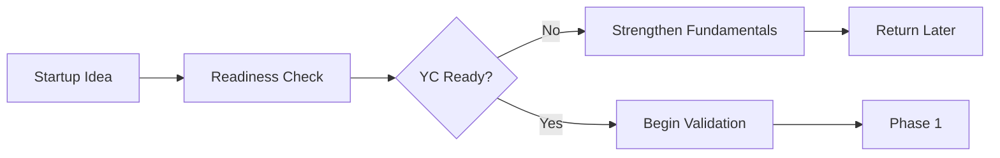
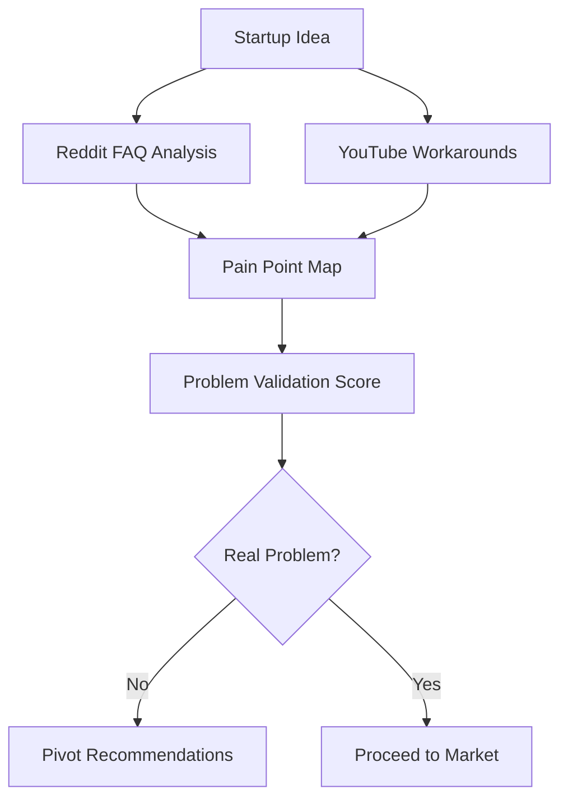
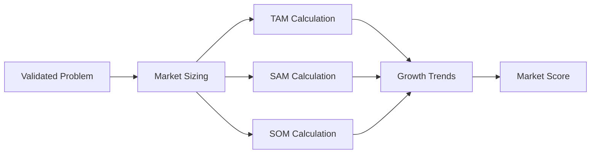
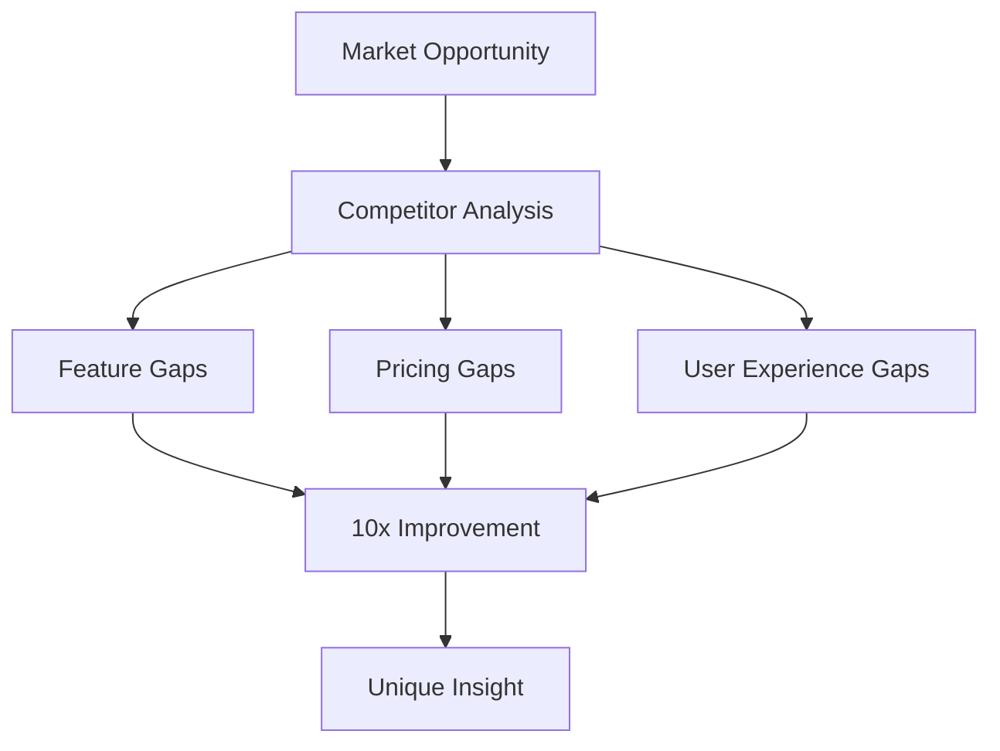
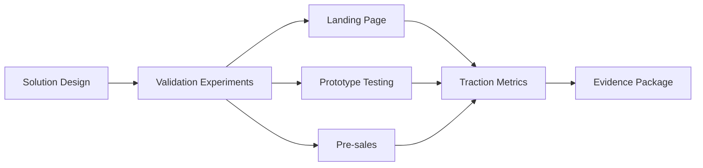
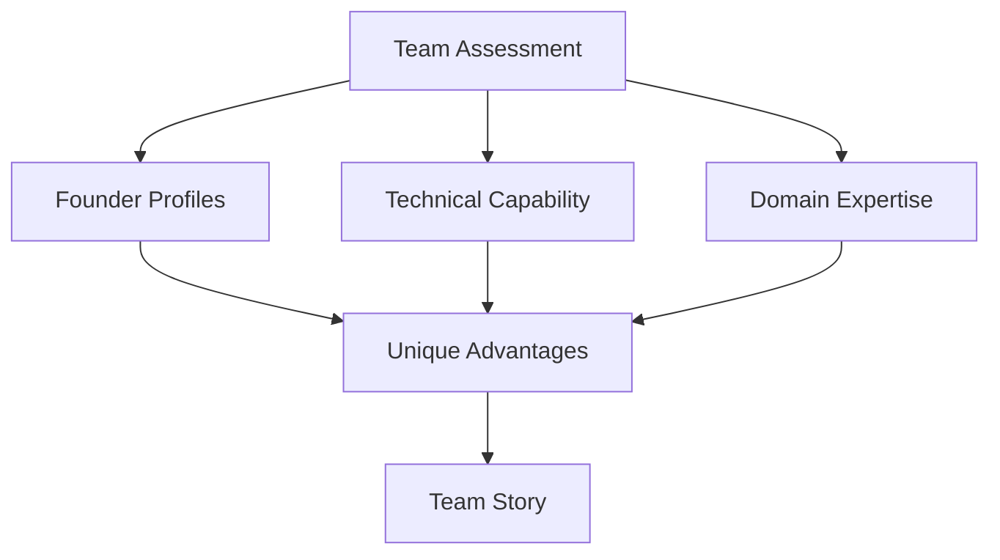
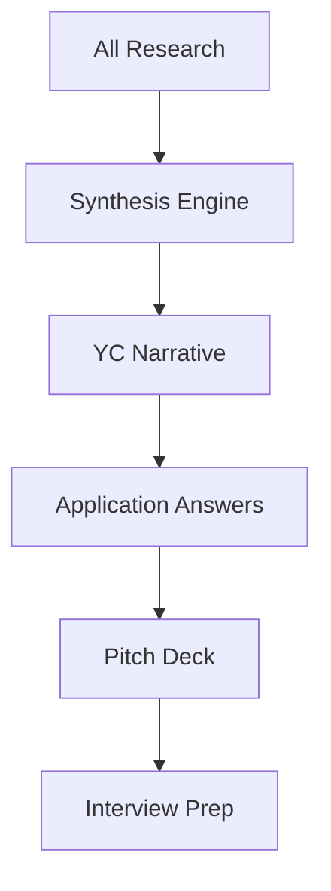

# YC Idea Validator & Refinement Engine Meta-Workflow

This meta-workflow transforms startup ideas into YC-ready applications by orchestrating comprehensive market validation, competitive intelligence, and strategic refinement processes.

## Overview

Y Combinator looks for startups that solve real problems for specific users, have large market potential, and are led by capable teams. This meta-workflow systematically validates startup ideas against YC criteria, identifies weaknesses, and refines the pitch to maximize application success. It transforms raw ideas into compelling, evidence-backed YC applications.

## YC Application Criteria Addressed

1. **Problem Clarity**: Is this a real problem people desperately want solved?
2. **Solution Uniqueness**: Why is your approach 10x better?
3. **Market Size**: Can this be a billion-dollar company?
4. **Traction/Validation**: What evidence proves people want this?
5. **Team Fit**: Why are you the ones to build this?
6. **Insights**: What do you know that others don't?

## Component Workflows Used

### Problem Validation Phase
- `reddit-faq-issue-analysis.md` - Find real user pain points
- `youtube-content-trends.md` - Observe problem workarounds
- `fact-checking-workflow.md` - Verify market claims
- `comprehensive-qa-resolution.md` - Deep problem understanding

### Market Analysis Phase
- `market-overview-sizing.md` - TAM/SAM/SOM calculation
- `industry-trend-report.md` - Growth trajectories
- `consumer-feedback-analysis.md` - User willingness to pay
- `regulatory-impact-assessment.md` - Legal feasibility

### Competitive Intelligence Phase
- `competitor-identification-profiling.md` - Current solutions
- `product-feature-pricing-comparison.md` - Differentiation gaps
- `digital-presence-audit.md` - Go-to-market strategies
- `innovation-ip-scan.md` - Defensibility analysis

### Team & Execution Phase
- `executive-background-research.md` - Founder profiles
- `developer-hiring-trends.md` - Technical feasibility
- `research-innovation-tracking.md` - Technical moats
- `partnerships-alliances-research.md` - Strategic advantages

## Meta-Workflow Process

### Phase 0: YC Readiness Assessment
**Duration**: 30 minutes
**YC Reality Check**: "Are you actually ready for YC?"



**Quick Assessment Questions**:
1. **Founder-Problem Fit**: Do you have personal experience with this problem?
2. **Execution Velocity**: Have you built anything in the last 30 days?
3. **Market Intuition**: Can you name 10 people who desperately need this solved?
4. **Technical Capability**: Can your team actually build the solution?
5. **YC Timing**: Are you prepared to move to Silicon Valley for 3 months?

**Scoring**: 4-5 "Yes" answers → Proceed. 0-3 → Strengthen fundamentals first.

### Phase 1: Problem Discovery & Validation
**Duration**: 4-6 hours
**YC Question**: "What problem are you solving?"



**Activities**:

1. **Reddit FAQ & Issue Analysis**:
   ```
   Search patterns:
   - "[problem domain] help"
   - "[current solution] alternatives"
   - "[industry] frustrations"
   - "I wish there was"
   - "Does anyone know how to"
   ```
   
   Extract:
   - Frequency of problem mentions
   - Current workarounds
   - Willingness to pay signals
   - Urgency indicators

2. **YouTube Content Trends**:
   - Tutorial views for workarounds
   - "How to" search volumes
   - Comment frustrations
   - Time spent on solutions

3. **Problem Scoring Matrix**:
   | Indicator | Weight | Score | Evidence |
   |-----------|--------|-------|----------|
   | Frequency | 25% | [1-10] | [Data] |
   | Urgency | 25% | [1-10] | [Data] |
   | Current Pain | 25% | [1-10] | [Data] |
   | Willingness to Pay | 25% | [1-10] | [Data] |

**Output**: Problem Validation Report with YC-style problem statement

### Phase 2: Market Size & Growth Analysis
**Duration**: 3-4 hours
**YC Question**: "How big can this company get?"



**Activities**:

1. **Market Overview & Sizing**:
   - Industry reports for TAM
   - Competitor revenues for validation
   - Geographic expansion potential
   - Adjacent market opportunities

2. **Industry Trend Analysis**:
   - 5-year growth rates
   - Technology enablers
   - Regulatory tailwinds
   - Cultural shifts

3. **Consumer Feedback Analysis**:
   - Price sensitivity research
   - Feature priorities
   - Switching costs
   - Adoption barriers

**YC Market Narrative Template**:
```
The [INDUSTRY] market is worth $[TAM] globally and growing at [X]% annually. 
Our initial segment [DESCRIPTION] represents $[SAM]. 
We can capture [Y]% ($[SOM]) in [Z] years because [UNIQUE ADVANTAGE].
```

### Phase 3: Competitive Landscape & Differentiation
**Duration**: 4-5 hours
**YC Question**: "What are you building and why is it 10x better?"

*Note: A dedicated 10x Better Framework workflow suite will be developed to systematically identify order-of-magnitude improvements. For now, we use the basic framework below.*



**Activities**:

1. **Competitor Identification & Profiling**:
   - Direct competitors
   - Indirect solutions
   - Failed attempts (why failed?)
   - Big tech threat assessment

2. **Product Feature & Pricing Comparison**:
   - Feature matrix development
   - Price point analysis
   - Business model comparison
   - Customer satisfaction scores

3. **Innovation & IP Scan**:
   - Patent landscape
   - Technical barriers
   - Network effects potential
   - Switching costs creation

**10x Better Quick Assessment**:
```
Current Solution: [Description]
Pain Points: [List from user research]  
Our Approach: [Description]
Why 10x Better:
- [Dimension 1]: Order of magnitude improvement because [insight]
- [Dimension 2]: Paradigm shift from [old] to [new] approach
- [Dimension 3]: Eliminates entire category of friction

10x Test: Would users switch immediately if offered this for free?
```

*Full 10x Better Framework (future workflow suite) will include:*
- *Systematic breakthrough identification methods*
- *Technology discontinuity analysis*  
- *Business model innovation patterns*
- *User experience paradigm shifts*

### Phase 4: Traction & Validation Strategy
**Duration**: 3-4 hours
**YC Question**: "How do you know people want this?"



**Activities**:

1. **Viral Content Monitoring**:
   - Similar product launches
   - User excitement signals
   - Sharing patterns
   - Community formation

2. **Campaign Impact Evaluation**:
   - Competitor launch analysis
   - Marketing channel effectiveness
   - CAC benchmarks
   - Viral coefficients

3. **Rapid Validation Experiments**:
   Based on research into effective validation methods:
   
   **Template 1: Landing Page + Payment Test**
   - Create simple landing page describing solution
   - Add "Pre-order now" button with real payment
   - Target: 5% conversion rate indicates strong demand
   
   **Template 2: Concierge MVP**  
   - Manually deliver the service to 5-10 early customers
   - Charge real money for manual solution
   - Success metric: Customers pay and ask for more
   
   **Template 3: Problem Interview Sprint**
   - Conduct 10 structured customer interviews  
   - Use research-validated interview scripts
   - Success metric: 80% confirm this is top-3 problem
   
   *Note: Future workflow will include comprehensive rapid validation sprint methodology.*

**Traction Evidence Hierarchy**:
```
Tier 1: Revenue/Paid Pilots ($X from Y customers)
Tier 2: LOIs/Commitments (Z companies committed)
Tier 3: Waitlist Signups (A people in B days)
Tier 4: User Research (C interviews showing need)
```

### Phase 5: Team & Execution Analysis
**Duration**: 2-3 hours
**YC Question**: "Why are you the team to build this?"



**Activities**:

1. **Executive Background Research** (on founders):
   - Previous achievements
   - Domain expertise
   - Technical capabilities
   - Network advantages

2. **Developer Hiring Trends**:
   - Technical feasibility
   - Talent availability
   - Development costs
   - Time to MVP

3. **Research Innovation Tracking**:
   - Technical moats
   - Research advantages
   - Unique insights
   - Future capabilities

**Team Narrative Components**:
```
- Founder-Problem Fit: [Personal connection/expertise]
- Unique Insight: [What we know others don't]
- Execution Speed: [Why we'll win the race]
- Unfair Advantages: [Network/skills/experience]
```

### Phase 6: YC Application Synthesis
**Duration**: 4-6 hours



## Output Format

```markdown
# YC Application Package: [Startup Name]
## One-Line Pitch: [Clear, memorable description]
## Validation Date: [Date]

### 1. Executive Summary for YC

**The Opportunity**
[Problem] affects [target users] who currently [workaround]. This is a $[TAM] market growing at [X]% annually. Our solution [description] is 10x better because [unique insight].

**Traction**: [Most impressive metric]
**Team**: [Why you're uniquely qualified]
**Ask**: Seeking YC to [specific goals]

### 2. Core YC Application Answers

#### Describe what your company does (50 words)
[Clear, jargon-free description backed by user research data]

#### What problem are you solving?
**The Problem**: [Specific problem from Reddit/YouTube research]

**Evidence**: 
- [X] Reddit posts/month asking for solutions
- [Y] YouTube views on workaround videos
- $[Z] spent on inferior alternatives

**Real User Quote**: "[Actual quote from research]"

#### How big is the market?
**TAM**: $[X]B - [Description and source]
**SAM**: $[Y]B - [Our addressable segment]
**SOM**: $[Z]M - [Realistic 5-year capture]

**Growth Drivers**:
1. [Trend 1] - [Data]
2. [Trend 2] - [Data]
3. [Trend 3] - [Data]

#### Who are your competitors?
| Competitor | Their Approach | Why We Win |
|------------|----------------|------------|
| [Company A] | [Description] | [Our advantage] |
| [Company B] | [Description] | [Our advantage] |
| Status Quo | [Current solution] | [Why it fails] |

**Key Insight**: [What we understand that they don't]

#### What's your unique insight?
Based on [research/experience], we discovered:
1. **Technical Insight**: [From innovation tracking]
2. **Market Insight**: [From trend analysis]
3. **User Insight**: [From Reddit/YouTube research]

This allows us to [unique approach] while others [conventional approach].

#### Describe your traction
- **Validation Metrics**:
  - [Metric 1]: [Number] ([X]% MoM growth)
  - [Metric 2]: [Number] (vs. industry average of [Y])
  - [Metric 3]: [Number] ([Context])

- **User Love Indicators**:
  - "[User testimonial]"
  - [X]% referral rate
  - [Y] hour average session time

#### Why are you the team to build this?
**[Founder 1]**: [Background] with [specific relevant achievement]
**[Founder 2]**: [Background] with [specific relevant achievement]

**Unfair Advantages**:
1. [Unique expertise/experience]
2. [Network/relationships]
3. [Technical breakthrough]

**Origin Story**: [Brief narrative of discovery]

### 3. Risk Analysis & Mitigation

#### Identified Risks (from research)
| Risk | Probability | Impact | YC Answer | Evidence |
|------|-------------|---------|-----------|----------|
| [Competition] | Medium | High | [Mitigation] | [Data] |
| [Technical] | Low | High | [Mitigation] | [Data] |
| [Regulatory] | Low | Medium | [Mitigation] | [Data] |
| [Market] | Medium | Medium | [Mitigation] | [Data] |

### 4. Financial Model & Metrics

#### Unit Economics (validated by competitor analysis)
- **CAC**: $[X] (based on [data source])
- **LTV**: $[Y] (based on [data source])
- **Gross Margin**: [Z]% (vs. industry [A]%)
- **Payback Period**: [B] months

#### Growth Model
```
Month 1-3: [X] users (validation phase)
Month 4-6: [Y] users (product-market fit)
Month 7-12: [Z] users (scaling)
Year 2: [A] users (expansion)
```

### 5. YC Interview Preparation

#### Likely Questions & Evidence-Based Answers

**Q: How do you know this is a real problem?**
A: [Data from Reddit analysis] + [YouTube evidence] + [User interviews]

**Q: Why hasn't this been solved before?**
A: [Technology timing] + [Market evolution] + [Our unique insight]

**Q: What if Google builds this?**
A: [Defensibility from IP scan] + [Network effects] + [Speed advantage]

**Q: How do you acquire customers?**
A: [Channel strategy from competitor analysis] + [Viral mechanics] + [Community]

### 6. Supporting Evidence Library

#### User Research Artifacts
- Reddit analysis: [Link to full report]
- YouTube trends: [Link to data]
- User interviews: [Summaries]
- Competitor teardowns: [Analysis]

#### Market Research
- Industry reports: [Sources]
- Growth projections: [Data]
- Regulatory landscape: [Summary]
- Technology trends: [Analysis]

#### Traction Documentation
- Metrics dashboard: [Screenshots]
- User testimonials: [Collection]
- Press coverage: [Links]
- Product demos: [Videos]

### 7. Pitch Deck Outline (data-driven)

1. **Problem** - [Validated pain point with data]
2. **Solution** - [10x better approach]
3. **Market** - [TAM/SAM/SOM with sources]
4. **Product** - [Key features users want]
5. **Traction** - [Validation metrics]
6. **Business Model** - [Unit economics]
7. **Competition** - [Positioning map]
8. **Team** - [Unique qualifications]
9. **Ask** - [Specific YC goals]

### 8. Post-Application Strategy

#### If Accepted
1. Focus areas based on research gaps
2. Mentor matching preferences
3. Demo Day positioning

#### If Rejected
1. Weak points to address
2. Additional validation needed
3. Reapplication timeline

---

## Validation Report Summary

### Strengths (backed by data)
1. **Problem Validity**: [Score]/10 - [Evidence summary]
2. **Market Size**: [Score]/10 - [Evidence summary]
3. **Solution Differentiation**: [Score]/10 - [Evidence summary]
4. **Team Fit**: [Score]/10 - [Evidence summary]
5. **Traction Quality**: [Score]/10 - [Evidence summary]

### Recommended Improvements
1. **[Area]**: [Specific action based on research]
2. **[Area]**: [Specific action based on research]
3. **[Area]**: [Specific action based on research]

### YC Readiness Score: [X]/100

**Go/No-Go Recommendation**: [Decision with rationale]

---

**Report Metadata**
- Research Duration: [X] hours
- Data Points Analyzed: [Y]
- Confidence Level: [High/Medium/Low]
- Key Assumptions: [List]
- Next Steps: [Prioritized actions]
```

## YC-Specific Optimizations

### 1. Execution Velocity Indicators
Based on YC research, the workflow emphasizes:
- **Speed signals**: Progress made in last 30 days
- **Iteration capacity**: How quickly you can test hypotheses  
- **Implementation focus**: Building > Planning ratio
- **Momentum metrics**: Weekly progress indicators

### 2. Problem-Founder Fit Emphasis  
The workflow specifically analyzes:
- Personal connection to problem
- Domain expertise evidence  
- Previous relevant experience
- Network advantages

### 3. 10x Better Framework
Instead of incremental improvements, identifies:
- Order of magnitude improvements
- Paradigm shifts
- Technology discontinuities
- Business model innovations

### 4. Rapid Validation Focus
Prioritizes evidence that shows:
- Users desperately want this
- Willingness to pay now
- Organic growth potential
- Strong retention signals

### 5. Scalability Proofs
Demonstrates:
- Large market opportunity
- Repeatable sales process
- Low marginal costs
- Network effects potential

## Common YC Application Mistakes Avoided

1. **Unclear Problem**: Reddit/YouTube research ensures real user pain
2. **Small Market**: Multiple sizing methods validate billion-dollar potential
3. **No Differentiation**: Competitor analysis reveals unique positioning
4. **Weak Team Story**: Background research highlights relevant strengths
5. **No Validation**: Multiple traction strategies provided

## Customization Options

### For Different Stages
- **Idea Stage**: Heavy on problem validation and market sizing
- **Prototype Stage**: Focus on user feedback and iteration
- **Revenue Stage**: Emphasize growth metrics and unit economics

### For Different Industries
- **B2B SaaS**: Enterprise buyer research, longer sales cycles
- **Consumer**: Viral mechanics, community building
- **Marketplace**: Supply/demand dynamics, liquidity
- **Deep Tech**: Research advantages, IP strategy

## Success Metrics

The effectiveness of this meta-workflow is measured by:
- **Application Acceptance Rate**: % of apps accepted to YC
- **Interview Conversion**: % getting interviews
- **Validation Speed**: Time from idea to validated concept
- **Pivot Quality**: Better ideas discovered through research
- **Founder Confidence**: Clarity and conviction in pitch

This meta-workflow transforms vague startup ideas into compelling, evidence-backed YC applications that demonstrate deep problem understanding, large market opportunity, unique insights, and strong founder-market fit.

## Future Workflow Developments

Based on research findings, the following specialized workflow suites will be developed:

### 1. 10x Better Framework Workflow Suite
A comprehensive system for identifying order-of-magnitude improvements:
- **Technology Discontinuity Analysis**: Spotting paradigm shifts
- **Business Model Innovation Patterns**: Revolutionary approaches
- **User Experience Breakthrough Methods**: Eliminating friction categories
- **Competitive Moat Assessment**: Sustainable advantages

### 2. Rapid Validation Sprint Methodology
Multi-day structured validation campaigns:
- **7-Day Problem Validation Sprint**: Customer interview intensive
- **14-Day Solution Validation Sprint**: MVP testing cycles  
- **30-Day Traction Validation Sprint**: Revenue/growth validation
- **Pivot Decision Framework**: Data-driven iteration guidelines

### 3. Founder Psychology & Momentum Workflows
Addressing the human elements of startup validation:
- **Confidence Building Templates**: Progress visualization
- **Network Expansion Methods**: Customer access strategies
- **Validation Paralysis Recovery**: Action-forcing frameworks
- **Momentum Maintenance Systems**: Daily progress protocols

These future workflows will integrate with the current YC validator to create a comprehensive startup validation ecosystem.